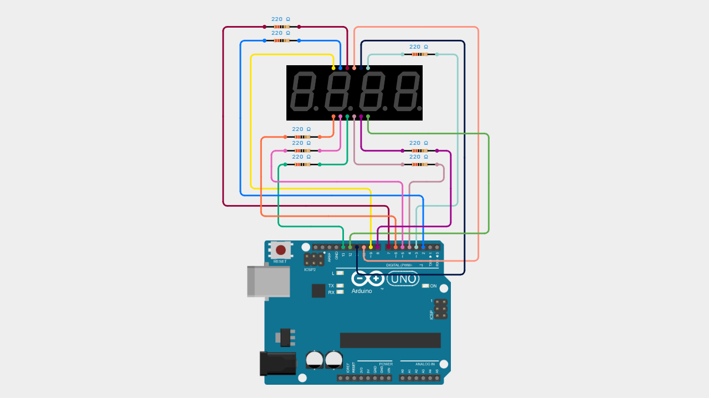

# Arduino 4-Digit 7-Segment Multi-Format Temperature Display (°C & Decimal)

A beginner-friendly Arduino project to display temperature in multiple formats (XX°C, XX.X°, XX.XC, XX.X) using a 4-digit 7-segment display without any external library.

This project demonstrates multiplexing, decimal point control, and custom character display such as degree (°) and Celsius (C).

---

## 📌 Project Overview

This project uses a **4-digit 7-segment display (common anode)** to show temperature values in four different formats:

- **XX°C** → Integer with degree and Celsius  
- **XX.X°** → Decimal with degree symbol  
- **XX.XC** → Decimal with Celsius  
- **XX.X** → Numeric only  

The display is controlled using **multiplexing**, allowing efficient use of Arduino pins.

No external libraries are used, making it ideal for beginners to understand the core working principle.

---

## 🧰 Components Required

- Arduino Uno / Nano  
- 4 Digit 7 Segment Display (Common Anode)  
- 8x Resistor 220Ω (for segments a–g + dp)  
- Jumper Wires  
- Breadboard (optional)  

---

## 🔌 Wiring Connections

### Segment Pins (with resistor 220Ω)

| Segment | Arduino Pin |
|--------|-------------|
| a      | D2          |
| b      | D3          |
| c      | D4          |
| d      | D5          |
| e      | D6          |
| f      | D7          |
| g      | D8          |
| dp     | D13         |

> Each segment must use a **220Ω resistor**

---

### Digit Pins (no resistor)

| Digit | Arduino Pin |
|------|-------------|
| D1   | D9          |
| D2   | D10         |
| D3   | D11         |
| D4   | D12         |

---

## 📷 Wiring Diagram

> Ensure segment pins use resistors and digit pins are connected correctly.

---

## 💻 Arduino Code

You can download the Arduino sketch here:

[Download Arduino Code](Arduino_4_Digit_7_Segment_Multi_Format_Temperature_Display.ino)

Or open the `.ino` file directly inside this repository.

---

## 🚀 Getting Started

1. Connect all components based on the wiring table.  
2. Upload the Arduino code to your board.  
3. Power the Arduino.  
4. The display will automatically cycle through:
   - 27°C  
   - 27.5°  
   - 27.5C  
   - 27.5  

---

## 🧠 Learning Concepts

This project helps you understand:

- Multiplexing 7-segment display  
- Digital output control  
- Decimal point handling  
- Custom character mapping (° and C)  
- Data formatting (integer vs float)  

---

## 🎥 Video Tutorial

Watch the full step-by-step tutorial on YouTube:

In this video, you will see:
- Complete wiring demonstration  
- Code explanation  
- Multiplexing concept  
- Display format switching  

---

## 📄 License

This project is open-source and free to use for educational purposes.

---

Happy Coding 🚀
